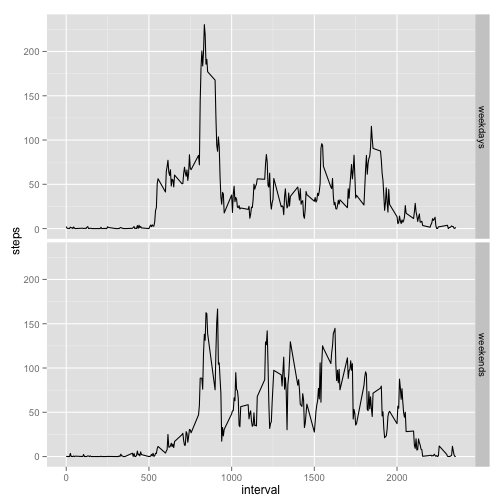

Reproductive Data Analysis: Assignment 1
==
### 11/16/2014 


### Loading and procesing the data


```r
unzip("activity.zip","activity.csv")
activity<-read.csv("activity.csv", quote="\"'", stringsAsFactors=F)
```
1: Transforming the date variable of the activity data into the date class:


```r
activity$date<-as.Date(activity$date)
```

### The Mean Total Number of Steps Taken Per Day

1: Make a histogram of the total number of steps taken each day:

```r
attach(activity, warn.conflicts=F)

# Aggregate the sum of steps of activiy by date ignoring NA:
aggSteps<-aggregate(activity[,c(1,3)], by=list(date), FUN=sum, na.rm=TRUE)

# Create a Histogram of the above data:
hist(aggSteps$steps, main="Total Number of Steps Taken Each Day",xlab = "Steps")
```

 


2: Calculate the mean and median total number of steps per day:

```r
mean(aggSteps$steps)
```

```
## [1] 9354.23
```

```r
median(aggSteps$steps)
```

```
## [1] 10395
```

### The Average Daily Activity Pattern
1: Make a time series plot of the 5-minutes interval (x-axis) and the average number of steps taken, averaged across all days (y-axis):

```r
# Aggregate the mean of steps of activity by the intervals:
aggInt<-aggregate(activity[,c(1,3)], by=list(interval), FUN=mean,na.rm=T)

# Load ggplot2:
library(ggplot2)

# Create the plot of the above data:
qplot(interval, steps,data=aggInt , geom="line")
```

 

2: Find which 5-minute interval, on average across all the days in the dateset, contains the maximum number of steps:


```r
aggInt[which(aggInt$steps==max(aggInt$steps)),]$interval
```

```
## [1] 835
```

### Imputing missing values

1: Calculate and report the totla number of missing values in the dataset:


```r
# Since missing values exist in the step data, the total number of the missing value can be derived from this variable:
sum(with(activity, is.na(steps)))
```

```
## [1] 2304
```

2: Using the mean of the steps for 5-minute interval to fill in the missing values: 


```r
# create the vector matching the missing values of steps with the mean values of the steps for 5-minute interval:

actNA<-aggInt[match(activity[is.na(activity),3],aggInt[,3]),2]

# fill in the missing values of the steps in the activity with the vector, actNA, creatd above:

activity[is.na(activity),]$steps<-actNA
```

3: Aggregate the dataframe, activity, by the total number of steps taken each day: 

```r
aggSteps2<-aggregate(activity[,c(1,3)], by=list(date), FUN=sum, na.rm=TRUE)
```

4: Make a histogram of the dataframe, aggSteps2, created above:

```r
hist(aggSteps2$steps, main="Total Number of Steps Taken Each Day", xlab="Steps")
```

 

5:Calculate and report the mean and median total number of steps taken per day: 

```r
mean(aggSteps2$steps)
```

```
## [1] 10766.19
```

```r
median(aggSteps2$steps)
```

```
## [1] 10766.19
```

The mean and median total number of steps derived from aggSteps2 differ from the mean and median total number of steps derived from  aggSteps. The imputing missing data on the total steps increased the mean, 9354.23, and median, 10395, of the daily steps of aggSteps (the dataset without the imputation). 

### Differences in activity patterns between weekdays and weekends

1: Create a new factor variable in the dataset with two levels - "weekday" and "weekend" indicating whether a given date is a weekday or weekend:


```r
# Create a factor variable classfying weekdayas and weekends of the dataframe, activity:

activity[which(weekdays(activity$date)=="Saturday"|weekdays(activity$date)=="Sunday"),4]<-"weekends"

activity[which(!weekdays(activity$date)=="Saturday" & !weekdays(activity$date)=="Sunday"),4]<-"weekdays"

# Convert the classification variable into the factor variable: 
activity[,4]<-as.factor(activity[,4])
```

2: Make a panel plot containing a time series plot of the 5-minute interval and the average number of steps taken, averaged across all weekdays or weekends:


```r
attach(activity, warn.conflicts=F)

# Aggregate activity by the interval and factor variables (weekdays, weekends):
aggAct<-aggregate(activity[,c(1,3)], by=list(interval,V4), FUN=mean,na.rm=T)

# Create the layer of the ggplot for aggData:
sp <- ggplot( aggAct, aes(x=interval, y=steps)) + geom_line()

# Split the plots according to weekdays and weekends:
sp +facet_grid(Group.2~.)
```

 
